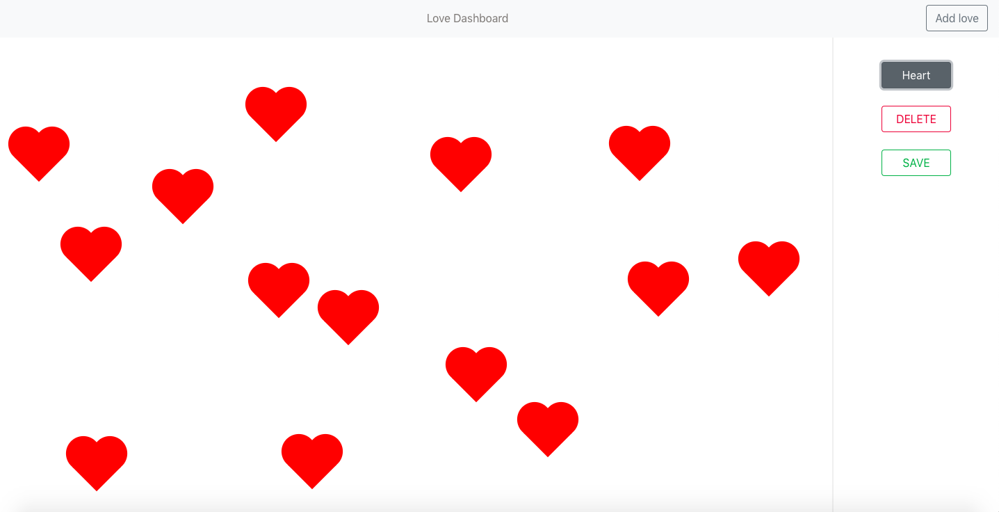
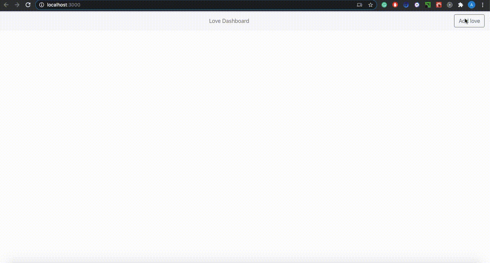

# LoveDashboard

LoveDashboard is a simple and funny React app. Spread love, leave a message for your loved ones, or just have fun and make as much hearts as you can.


## Demonstration



Technologies used:
* React
* React Bootstrap
* styled-components

## Features
With LoveDashboard you can:
* Add infinite heart symbols on dashboard
* Symbols appear on random positions, not overlapping each other
* Manage your dashboard with Local Storage
* Save your changes
* Delete all the changes with 'Delete' and 'Save' buttons

## How To Use

* clone or download the repo
* ``` cd my-app ```
* ``` npm install ``` to install the dependencies
* ``` npm start``` to run the app


